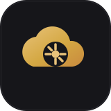
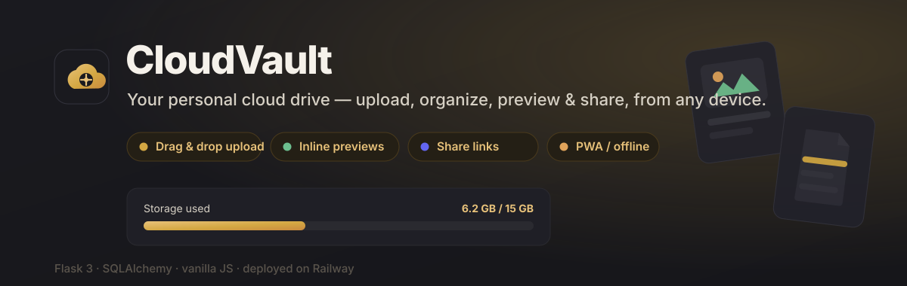
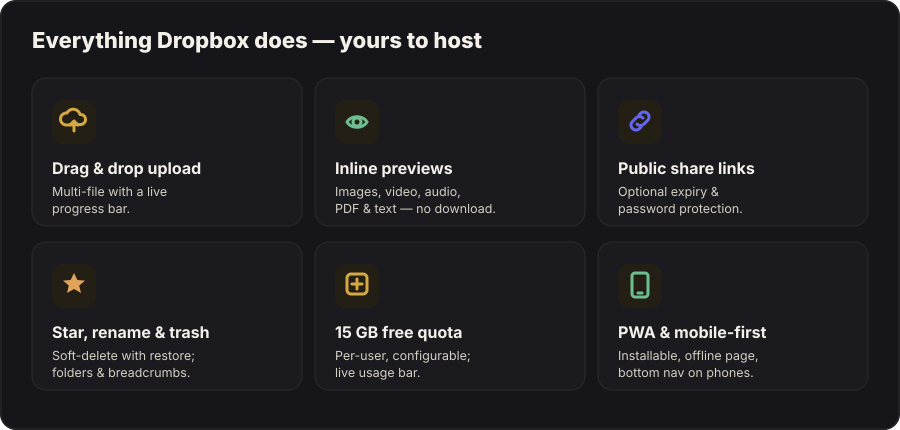
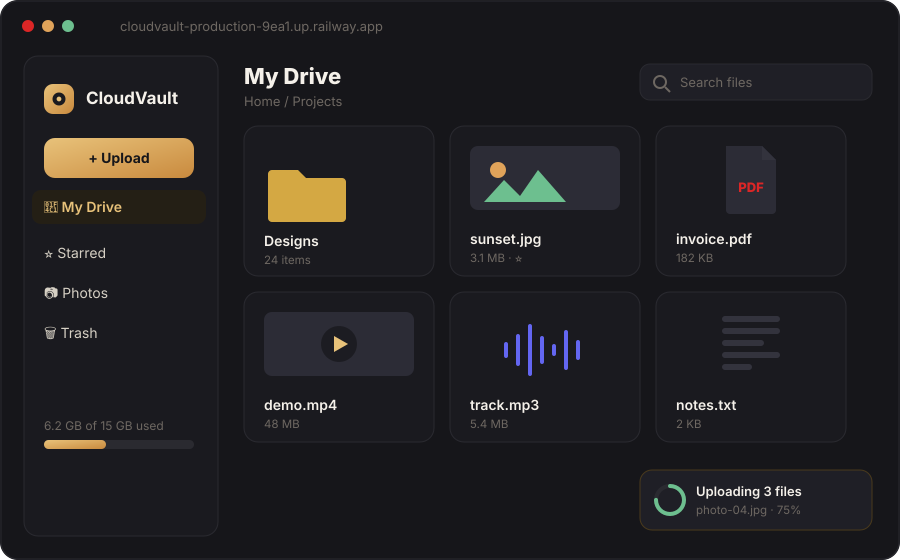

<div align="center">





# CloudVault

**Your personal cloud drive** — upload, organize, preview and share files from any device. A self-hostable Dropbox / Google Drive, built with Flask.

[](https://cloudvault-production-9ea1.up.railway.app)


</div>

---

## ✨ Features



| | |
| --- | --- |
| 🔐 **Secure auth** | Email/password with Flask-Login + bcrypt hashes |
| 📤 **Drag & drop upload** | Multi-file with a live progress bar |
| 📁 **Folders** | Breadcrumbs and nested navigation |
| ⭐ **Organize** | Star, rename, trash (soft delete) and restore |
| 🔗 **Share links** | Public links with optional expiry & password |
| 👁 **Inline previews** | Images, video, audio, PDF and text — no download |
| 🔍 **Search** | Find files by name instantly |
| 💾 **Quota** | 15 GB free per user (configurable), with a live usage bar |
| 📱 **PWA** | Installable, offline page, mobile-first bottom nav |

---

## 🖥️ The drive



---

## 🚀 Run locally

```bash
git clone https://github.com/khaledq84ever/cloudvault
cd cloudvault
pip install -r requirements.txt
python3 app.py
# open http://localhost:5000
```

Copy `.env.example` → `.env` and set `SECRET_KEY` before running in anything but local dev.

---

## ☁️ Deploy to Railway

1. Push the repo to GitHub.
2. Railway → **New Project → Deploy from repo** (uses the included `Dockerfile`).
3. Add a **Volume** mounted at `/app/uploads` **and** `/app/instance` so files and the DB persist across deploys.
4. Set the `SECRET_KEY` environment variable.

> ⚠️ Without a volume, uploads and the SQLite DB are wiped on every redeploy.

---

## 🧱 Tech stack

| Layer | Tech |
| --- | --- |
| **Backend** | Flask 3 · SQLAlchemy · Flask-Login |
| **Frontend** | Vanilla JS + CSS (no framework), PWA (service worker + manifest) |
| **Storage** | Local filesystem — keys are UUIDs, ready to point at S3/R2 |
| **Database** | SQLite (swap to Postgres for production) |
| **Deploy** | Railway (`Dockerfile`) |

### Moving storage to S3 / R2 (production)
Storage keys are already UUIDs, so swapping backends is localized: replace the
`user_dir()` / `send_file()` calls in `app.py` with `boto3` `put_object` and
signed URLs, and point them at your bucket.

---

## 📁 Project layout

```
cloudvault/
├── app.py            Flask app — routes, auth, upload, share, preview
├── models.py         SQLAlchemy models (User, File, Folder, Share …)
├── storage.py        File-on-disk helpers (UUID keys, user dirs)
├── thumbs.py         Thumbnail generation
├── utils.py          Quota, mime, helpers
├── events.py         SSE / live events
├── templates/        Jinja pages (drive, landing, share, settings …)
└── static/
    ├── css/app.css   Warm gold-on-dark theme
    ├── js/           drive · appnav · pwa
    └── icons/        favicon + PWA app icons
```

---

## 🎨 Brand

| Token | Value |
| --- | --- |
| Gold | `#d4a843` |
| Amber | `#c98a3e` |
| Cream | `#f5f1ea` |
| Dark | `#16161a` |

---

<div align="center">
<sub>Built with Flask &amp; SQLAlchemy · deployed on Railway</sub>
</div>
